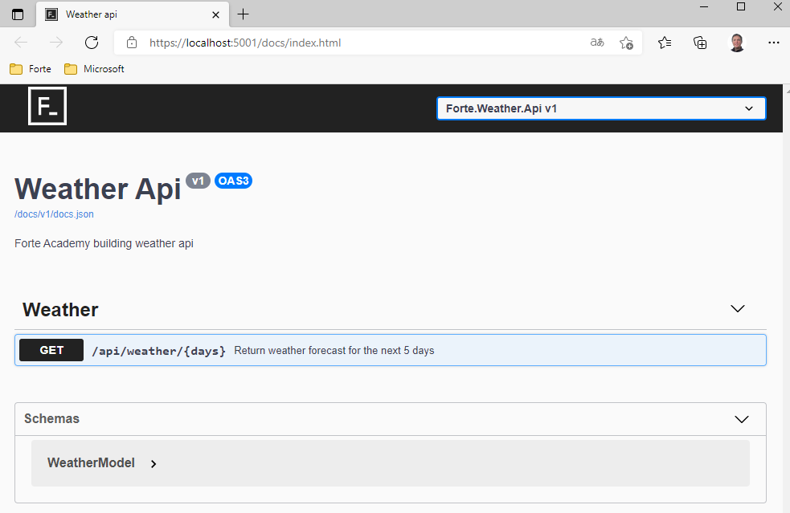
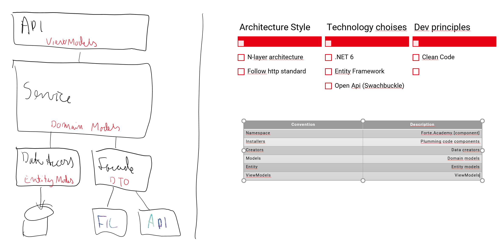

# Web Api building workshop
Learn how to build an pritty api with .net 6

This workshop is based on the default api template in Visual Studio 2022 and you will learn to build an api with customized documentation and an n-layer architecture.
It will be over-enginered, but the purpose is to give an insight in .net web api and building a well architected application.

| Session | Topics |
| ----- | ---- |
| [Session #0](/docs/00-get-started.md) | Get started and build your first api |
| [Session #1](/docs/01-api-documentation.md) | Customize and improve your api documentation |
| [Session #2](/docs/02-service-layer.md) | Introduce the service layer  |
| [Session #3](/docs/03-data-access-layer.md) | Introduce data access layer and use of database |
| [Session #4](/docs/04-configuration.md) | How to get data from a configuration file |

### Architecture

