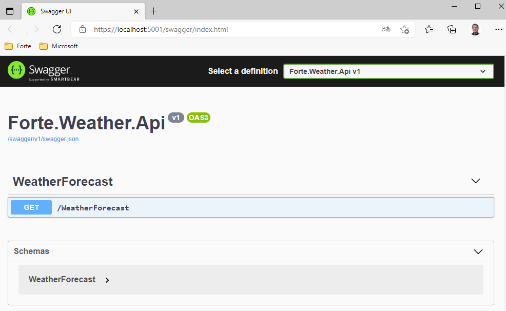

# Get started
In this session you will use the default api template in Visual Studio to create a new api.

# Starting Point
- Open Visual studio 2022

## Use template to create an default web api
- Press [ctrl][shif][n]
- Search for api and select template ASP.NET Core Web Api
- Click Next 
---
- Fill inn form and click Next
---
- Select freamework .NET 6 
- Select Enable OpenAPI support
- Click Create
---
- Build and run solution

Browser should open with swagger documentation

## Refactor
- Update nuget packages
- Refactor 
