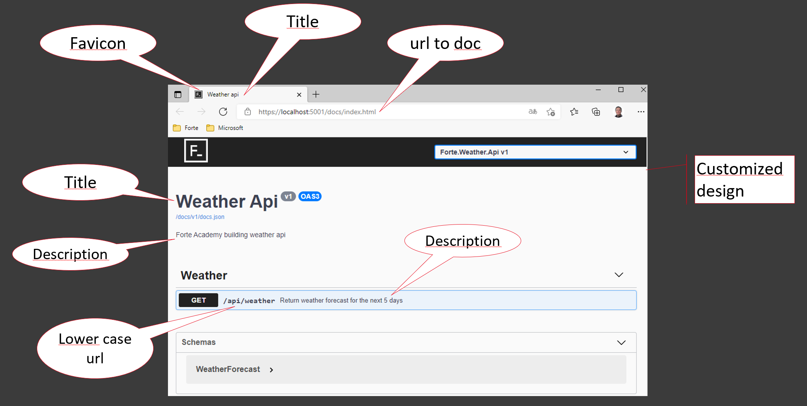

# Customize and improve your api documentation
In this session you learn to cuztomize and improve your api documentation


### Change the main title and add an description

```C#
  options.SwaggerDoc("v1", new() 
  { 
      Title = "Weather Api", 
      Version = "v1",
      Description = "Forte Academy building weather api"
  });
```

### Change section title to Weather
Rename Controller

### Lowercase endpoint url
Add route prefix to Controller
```C#
[Route("api/weather")]
```
### Add description to endpoint
First you need to autogenerate an xml documentation file by adding the following line below in the project file.
This will case a lot of errors due to missing comments in the code and to avoid this supress error 1591
```xml
<GenerateDocumentationFile>True</GenerateDocumentationFile>
<NoWarn>1591</NoWarn>
```
Get the full path to the generated documentation file
```C#
var xmlDocumentation = $"{Assembly.GetExecutingAssembly().GetName().Name}.xml";
var xmlPath = Path.Combine(AppContext.BaseDirectory, xmlDocumentation);
```
Add option for including xml comments in swagger (AddSwaggerGen)
```C#
options.IncludeXmlComments(xmlPath);
```
### Customize your url (/docs/index.html)
Set route prefix options (UseSwaggerUI)
```C#
options.RoutePrefix = "docs";
```
Your route template needs to reflect the new route prefix and you need to set new Swagger endpoint
```C#
app.UseSwagger(options => options.RouteTemplate = "docs/{documentName}/docs.json");
app.UseSwaggerUI(options =>
{
    options.RoutePrefix = "docs";
    options.SwaggerEndpoint("/docs/v1/docs.json", "Forte.Weather.Api v1");
});
```
### Customize your design

