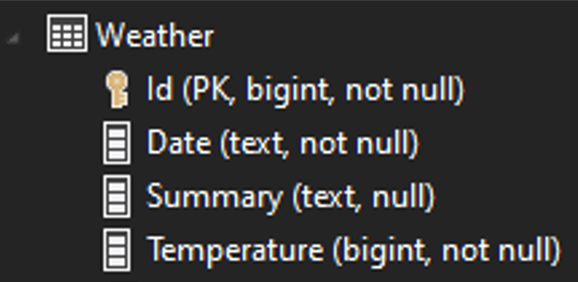

# Introduce data access layer and use of database
In this session we introduce a data access layer and store our weather data in a database (SQL Lite).
We reccomend to install Visual Studio Extension "SQLite and SQL Server Compact Toolbox" and use this to verify your database after creation

# Create Data Access Layer
First we need to add a new project as we did in the previous session.
In this project you need to add nuget package for sql lite 
```C#
<PackageReference Include="Microsoft.EntityFrameworkCore.Sqlite" Version="5.0.9" />
```

### Designing our database


We will use code first to create the database and to create the databas schema we crate an Entity class reflection our database design.
```C#
public class WeatherEntity
{
    [Key]
    public int Id { get; set; }

    public DateTime Date { get; set; }

    public string Summary { get; set; }

    public int Temperature { get; set; }
}
```
### Create a seed class to generate test data for our database.
We will extend the ModelBuilder with a Seed method that will generate random weather forcaste that we sould populate database with the first time.
```C#
public static class WeatherCreator
{
    private static readonly Random Random = new();

    private static readonly string[] Summaries = new[]
    {
        "Freezing", "Bracing", "Chilly", "Cool", "Mild", "Warm", "Balmy", "Hot", "Sweltering", "Scorching"
    };

    public static void Seed(this ModelBuilder builder)
    {
        builder.Entity<WeatherEntity>().HasData(Create());
    }

    private static IEnumerable<WeatherEntity> Create()
    {
        return Enumerable.Range(1, 20)
            .Select(index => new WeatherEntity
            {
                Id = index,
                Date = DateTime.Now.AddDays(index),
                Temperature = Random.Next(-20, 55),
                Summary = Summaries[Random.Next(Summaries.Length)]
            });
    }
}
```
### Setting up database
We create and DbContext that would create database and schema and also populate it with test data.
```C#
public class WeatherDbContext : DbContext
{
    public WeatherDbContext(DbContextOptions<WeatherDbContext> options) 
        : base(options)
    {
        if (Database.IsSqlite())
        {
            Database.EnsureCreated();
        }
    }

    public DbSet<WeatherEntity> Weather { get; set; }

    protected override void OnModelCreating(ModelBuilder modelBuilder)
    {
        modelBuilder.Seed();
    }
}
```
### Adding repository
USe of repository is a way to implement data access by encapsulation the set of objects persisted in a data store and the operations performed over them, providing a more object-oriented view of the persistence layer.
Add repository interface
```C#
public interface IWeatherRepository
{
    public Task<IEnumerable<WeatherEntity>> GetForecast(int quantity);
}
```
Add repository class that inherit from repository interface.
In this class we inject dbcontext in constructor and implment GetForecaste method
```C#
private readonly WeatherDbContext _context;

public WeatherRepository(WeatherDbContext context)
{
    _context = context;
}

public async Task<IEnumerable<WeatherEntity>> GetForecast(int quantity)
{
    return await _context.Weather
        .OrderBy(entity => entity.Id)
        .Take(quantity)
        .ToListAsync();
}
```

### Setting up dependency injection 
To follow the application architecture it is important that each layer is loosley coopled and that we follow the hirarcy 
which means that api layer only knows about service layer and the service layer only knows about the data access layer.
To achive this we will create an Installer class in each layer and the purpose of this class is to inject dependencies needed
in this layer. 

Add nuget package 'Microsoft.Extensions.DependencyInjection.Abstractions' to extend the IServiceCollection
```C#
public static class DbInstaller
{
    public static void AddDataAccess(this IServiceCollection services)
    {
        services.AddDbContext<WeatherDbContext>(options => options.UseSqlite("Data source=weather.db"));

        services.AddTransient<IWeatherRepository, WeatherRepository>();
    }
}
```
### Changing service layer
The service layer needs to inject data access layer and use repository to get data
```C#
services.AddDataAccess();

public WeatherService(IWeatherRepository repository)
{
    _repository = repository;
}

public async Task<IEnumerable<WeatherModel>> WeatherForcast(int days)
{
    return (await _repository.GetForecast(days)).ToModel();
}

```
As you noticed the repository method is async so to be consistent you should make requeste async through all layers

Build and run your solution an see if your api is returing weather forecast as expected.

### Add parameter in your http requeste to tell how many days you want forecast
Change endpoint in controller
```C#
[HttpGet("{days}")]
public async Task<IEnumerable<WeatherModel>> Get(int days = 5)
{
    return await _weatherService.WeatherForcast(days);
}
```
Remember to update documenation
### Refactor
- Stucture your files into catalouges for easy overview

